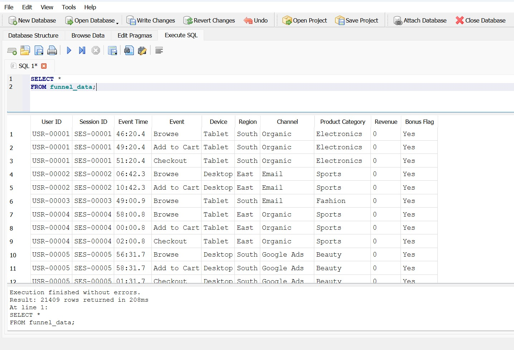
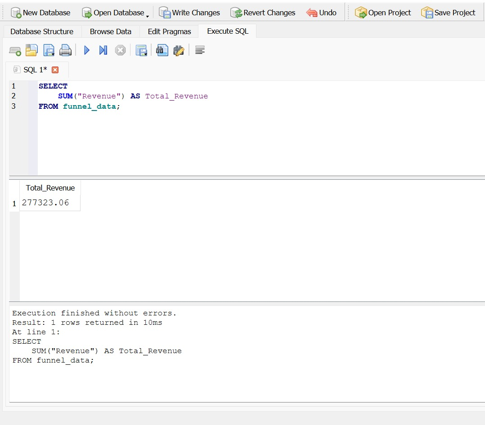
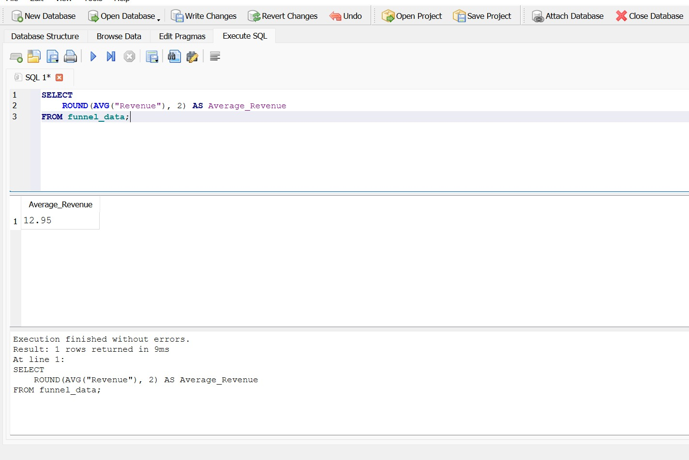
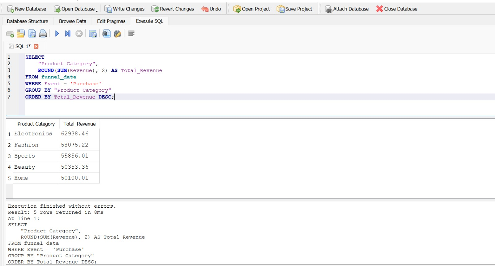
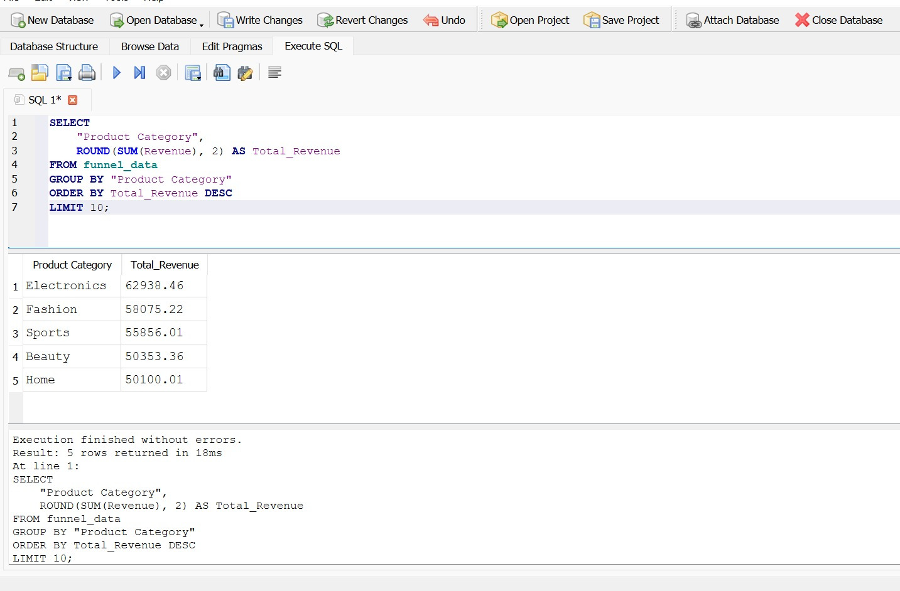
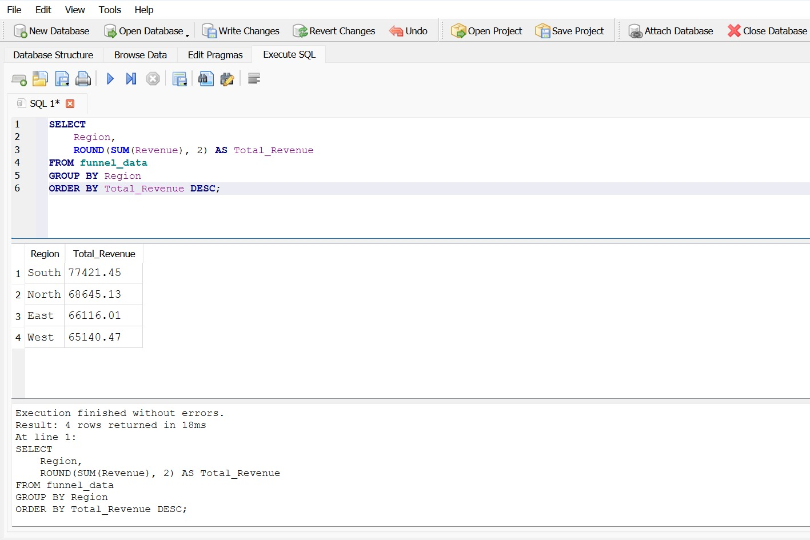
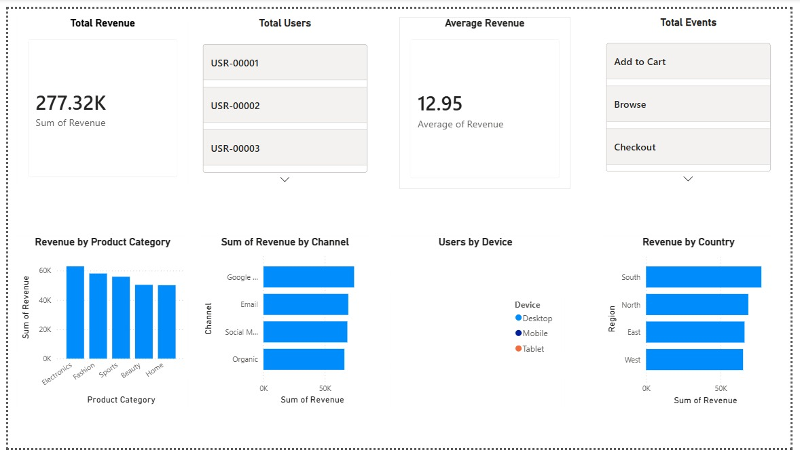
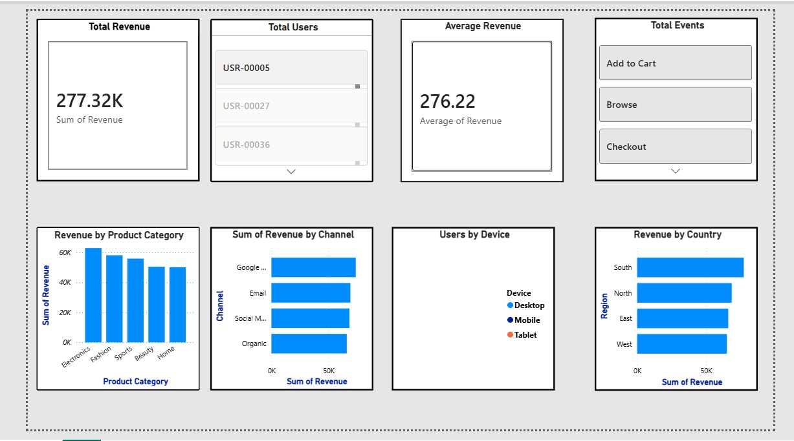
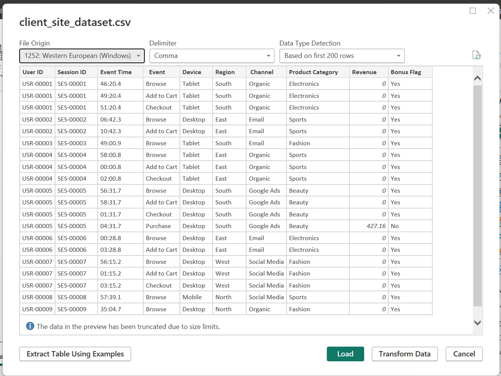

<div align="center">


<br/>


<br/>

[](#)
[](#)
[](#)
[](#)
[](#)
[](#)
[](#)
[](#)
[](#)

[](#)

</div>

<br/>

---

## 📌 Project Overview

This repository is a complete, end-to-end data analysis workflow built around real-world client website behaviour data.

The project demonstrates a full business intelligence pipeline: importing raw CSV data into a relational SQLite database, writing structured SQL queries to extract funnel metrics, revenue performance and user behaviour patterns, and finally presenting executive-level insights through an interactive Power BI dashboard.


> 🛠️ **Tools:** SQLite · DB Browser for SQLite · SQL · Power BI Desktop · DAX

> 📂 **Dataset:** Client Site Dataset (21,409 events · 10 columns)

---

## 🌟 Repository Highlights

✔ SQL Queries

✔ SQLite Database

✔ Interactive Dashboard

✔ Business Insights

✔ Documentation

✔ Screenshots

✔ Professional Structure

---

## 🎯 Project Objectives

- ✔ **Funnel Analysis** — Track user journey from Browse → Add to Cart → Checkout → Purchase and identify drop-off points
- ✔ **SQL Analytics** — Write structured queries for exploration, aggregation, revenue analysis and business insights
- ✔ **Revenue Analysis** — Break down total revenue by region, channel, device and product category
- ✔ **Drop-off Analysis** — Identify which funnel stage loses the most users and calculate conversion rates
- ✔ **Power BI Dashboard** — Build an interactive, executive-level dashboard with KPI cards and 5 visuals
- ✔ **Business Insights** — Generate 5 SQL insights + 5 dashboard insights + 3 actionable recommendations
- ✔ **BI Portfolio** — Demonstrate complete junior Data Analyst capability from raw data to business decision

---

## 🏢 Business Problem

A digital company wants to understand user behaviour on its platform. As a **Junior Data Analyst**, the task is to answer:

| Business Question | Analysis Method |
|---|---|
| How do users move through the purchase funnel? | Funnel Stage Analysis (SQL + Power BI Funnel Chart) |
| Where do users drop off the most? | Drop-off Rate Calculation per Event Stage |
| Which marketing channels bring the most revenue? | Revenue by Channel (GROUP BY + SUM) |
| Which devices generate higher engagement? | Device-level Conversion & Revenue Analysis |
| Which regions generate more revenue? | Regional Revenue Breakdown (SQL + Column Chart) |
| Who are the top-spending users? | Top 5 Users by Revenue Query |

---

## 🏗️ Project Architecture

```
📥 Raw CSV File (client_site_dataset.csv)
           │
           ▼
🗄️  SQLite Database (funnel_analysis.db)
     via DB Browser for SQLite
           │
           ▼
🔍 SQL Queries (funnel_analysis_queries.sql)
     Exploration · Funnel · Revenue · Insights · Drop-off
           │
           ▼
📊 Business Analysis
     Funnel Stages · Conversion Rates · Revenue Breakdown
           │
           ▼
📈 Power BI Dashboard
     KPI Cards · Funnel Chart · Bar · Column · Pie · Line
           │
           ▼
💡 Business Insights & Recommendations
```

---
## Project Workflow Diagram

```
CSV Dataset

↓

SQLite Database

↓

SQL Queries

↓

Business Analysis

↓

Power BI Dashboard

↓

Insights

↓

Recommendations

```

---

## 🛠️ Technologies Used

<div align="center">

| Technology | Badge | Purpose |
|---|---|---|
| **SQLite** |  | Lightweight relational database for storing CSV data |
| **SQL** |  | Querying, aggregating and analysing dataset |
| **DB Browser for SQLite** |  | GUI for database creation, CSV import and query execution |
| **Power BI Desktop** |  | Interactive dashboard and KPI visualisation |
| **DAX** |  | Calculated columns and measures in Power BI |
| **VS Code** |  | Writing and organising SQL files |
| **GitHub** |  | Version control and portfolio showcase |
| **Markdown** |  | Documentation (README + SQL-Command.md) |

</div>

---

## 🗂️ Dataset Information

| Field | Detail |
|---|---|
| **Dataset Name** | Client Site Dataset |
| **File** | `client_site_dataset.csv` |
| **Total Rows** | 21,409 events |
| **Total Columns** | 10 |
| **Database** | `funnel_analysis.db` (SQLite) |
| **Business Domain** | Digital Marketing / E-Commerce Funnel Analytics |
| **Date/Time** | Event Time column |
| **Unique Users** | 10,000 |
| **Unique Sessions** | 10,000 |
| **Total Revenue** | $277,323.06 |

**Dataset Columns:**

| Column | Type | Description |
|---|---|---|
| `User ID` |   Text | Unique identifier per user |
| `Session ID` | VARCHAR | Unique identifier per session |
| `Event Time` | Text | Timestamp of the event |
| `Event` | Text | Funnel stage (Browse / Add to Cart / Checkout / Purchase) |
| `Device` | Text | Desktop / Tablet / Mobile |
| `Region` | Text | North / South / East / West |
| `Channel` | Text | Google Ads / Email / Organic / Social Media |
| `Product Category` | Text | Category of product viewed or purchased |
| `Revenue` | Numeric | Revenue generated (0 for non-purchase events) |
| `Bonus Flag` | Text | Yes / No bonus indicator |

---

## 🗄️ Database Information

The raw CSV was imported into a **SQLite** relational database using **DB Browser for SQLite** — a free, open-source GUI tool for SQLite database management.

**Why SQLite?**

| Reason | Detail |
|---|---|
| ✅ Zero Configuration | No server setup required — single `.db` file |
| ✅ Lightweight | Perfect for local data analysis projects |
| ✅ SQL Compatible | Supports full standard SQL syntax |
| ✅ Portable | `.db` file can be shared and committed to GitHub |
| ✅ Industry Standard | Used in mobile apps, embedded systems, and analytics |

The database file `funnel_analysis.db` contains a single table (`client_site_dataset`) holding all 21,409 event records, with all columns preserved exactly as in the original CSV.

---

## 🔍 SQL Tasks Performed

All queries are saved in
```
 sql/funnel_analysis_queries.sql
```
### Task 1 — Data Exploration

Initial exploration queries to understand the dataset structure:
- Count of total rows to confirm data was imported correctly
- Count of unique users to understand audience size
- Count of unique sessions to measure platform reach
- Listing all distinct event types to confirm funnel stages
```
Uses: `SELECT COUNT(*)`, `COUNT(DISTINCT ...)`, `SELECT DISTINCT`
```


### Task 2 — Funnel Stage Analysis

The core funnel analysis tracking users through each stage:
- Count of total events broken down per event type
- Unique users at each funnel stage
- Conversion rate from Browse (top of funnel) through to Purchase (bottom of funnel)

```
Uses: `GROUP BY`, `COUNT`, `ORDER BY`, percentage calculations
```

### Task 3 — Revenue Analysis

Financial performance breakdown across multiple dimensions:
- Total revenue across all 21,409 events
- Revenue grouped by geographic region (North / South / East / West)
- Revenue broken down by marketing channel to identify best-performing acquisition source
- Revenue comparison across device types (Desktop / Tablet / Mobile)

```
Uses: `SUM()`, `AVG()`, `GROUP BY`, `ORDER BY DESC`
```

### Task 4 — Business Insights Queries

Targeted queries answering specific business questions:
- Top 5 highest-spending users ranked by total revenue contribution
- Best performing marketing channel by total and average revenue
- Highest revenue-generating region
- Product category generating the most purchase revenue
- Top products by total sales value

```
Uses: `GROUP BY`, `SUM()`, `ORDER BY DESC`, `LIMIT`
```
### Task 5 — Drop-off Analysis

Identifying where the funnel loses users:
- Calculating user count at each stage to pinpoint the largest drop
- Computing conversion rate at every transition (Browse→Cart, Cart→Checkout, Checkout→Purchase)
- Identifying the event type with the lowest forward conversion

```
Uses: `COUNT(DISTINCT)`, `GROUP BY Event`, subqueries, calculated percentage columns
```

---

## 📊 Power BI Dashboard

The cleaned dataset was imported into **Power BI Desktop** and a complete **Client Site Analytics Dashboard** was built with KPI cards and five interactive visuals.

**Dashboard Title:** Client Site Analytics Dashboard

**File:** 

``` 
`powerbi/Client_Site_Analytics_Dashboard.pbix`
 ```

---

## 🃏 Dashboard KPIs

<div align="center">

| KPI Card | Value | Description |
|---|---|---|
| 👥 **Total Users** | **10,000** | Unique users tracked in the dataset |
| 💰 **Total Revenue** | **$277,323** | Total revenue from all Purchase events |
| 📊 **Total Events** | **21,409** | All funnel events recorded |
| 🛒 **Total Purchases** | **1,004** | Completed purchase transactions |

</div>

---

## 📉 Dashboard Visuals

| # | Visual Type | Title | Insight Delivered |
|---|---|---|---|
| 1 | 🔽 **Funnel Chart** | User Journey Funnel | Shows drop-off at every stage: Browse→Cart→Checkout→Purchase |
| 2 | 📊 **Bar Chart** | Revenue by Channel | Compares Google Ads, Email, Organic, Social Media performance |
| 3 | 📈 **Column Chart** | Revenue by Region | North vs South vs East vs West revenue breakdown |
| 4 | 🥧 **Pie Chart** | Device Distribution | Desktop vs Tablet vs Mobile share of total events |
| 5 | 📉 **Line Chart** | Revenue Trend | Revenue movement over event time |

**Insight Panel (in dashboard):**
- 🔴 Biggest drop-off: **Checkout → Purchase** (70.9% drop)
- 🟢 Best channel: **Google Ads** (highest revenue contribution)
- 🏆 Most valuable segment: **Desktop users** (highest revenue per event)

---

## 📁 Repository Folder Structure

```text
week-4-sql-powerbi-funnel-analysis/
│
├── database/
│   ├── funnel_analysis.db           ← SQLite database
│   └── funnel_analysis.sqbpro       ← DB Browser project file
│
├── dataset/
│   └── client_site_dataset.csv      ← Raw dataset (21,409 rows)
│
├── docs/
│
├── powerbi/
│   ├── Client_Site_Analytics_Dashboard.pbix  ← Power BI file
│   ├── powerbi-dashboard.jpeg       ← Dashboard screenshot
│   ├── final-dashboard0.jpeg        ← Full dashboard view
│   └── loading-csv-powerbi.png      ← CSV import screenshot
│
├── screenshots/
│   ├── sql-query-01-view-data.jpeg
│   ├── sql-query-02-total-revenue.png
│   ├── sql-query-03-average-revenue.jpeg
│   ├── query-04-purchase-revenue-by-category.png
│   ├── query-04-top-products.png
│   ├── query-05-revenue-by-region.png
│   ├── final-dashboard.png
│   └── final-dashboard0.jpeg
│
├── sql/
│   ├── funnel_analysis_queries.sql  ← All SQL queries
│   └── SQL-Command.md               ← SQL commands reference
│
├── .gitignore
├── LICENSE
└── README.md
```

---

## 🖥️ SQL Query Screenshots

### Data Exploration & Revenue Queries

<div align="center">

| Query 01 — View Data | Query 02 — Total Revenue |
|:---:|:---:|
|  |  |
| *Initial data exploration — SELECT * to verify import* | *SUM(Revenue) — total platform revenue calculation* |

</div>

---

<div align="center">

| Query 03 — Average Revenue | Query 04.1 — Revenue by Category |
|:---:|:---:|
|  |  |
| *AVG(Revenue) — average transaction value analysis* | *SUMIF by Product Category — category performance* |

</div>

---

<div align="center">

| Query 05 — Top Products | Query 05 — Revenue by Region |
|:---:|:---:|
|  |  |
| *TOP 5 products ranked by total purchase revenue* | *Regional breakdown — North / South / East / West* |

</div>

---

## 📊 Power BI Dashboard Preview

<div align="center">

### Main Dashboard View



</div>

---

<div align="center">

### Full Dashboard View


</div>

---

<div align="center">

| Final Dashboard (Full Screen) | Loading CSV in Power BI |
|:---:|:---:|
|  |  |

</div>

---

## 💡 Key Business Insights

**From SQL Analysis:**

1. 🔽 **Checkout → Purchase is the biggest drop-off** — only 29.1% of users who reach Checkout complete the Purchase, making it the most critical leakage point in the funnel
2. 🛒 **Browse to Add to Cart conversion is 69.5%** — a relatively healthy top-funnel engagement, suggesting strong product discovery performance
3. 💰 **Total platform revenue is $277,323** generated entirely from 1,004 Purchase events — meaning 90% of users generate zero revenue
4. 🌍 **All four regions (North/South/East/West) show near-equal revenue distribution** — suggesting no geographic bias in the marketing strategy
5. 📱 **Google Ads is the top revenue-generating channel**, followed closely by Email — organic and social channels underperform in direct revenue contribution

**From Power BI Dashboard:**

6. 📊 **The Funnel Chart visually confirms** that the steepest drop occurs between Checkout and Purchase — a UX or trust issue at the payment stage is the likely cause
7. 💻 **Desktop users generate higher revenue per session** than Mobile and Tablet users — suggesting Desktop-first UX optimisation should be prioritised
8. 📅 **Revenue trend over time** shows consistent daily patterns with occasional peaks — promotional or seasonal events likely drive these spikes
9. 🎯 **Social Media has the lowest direct revenue contribution** despite significant traffic — indicates a brand awareness role rather than direct conversion
10. 🏆 **Top 5 users account for a disproportionate share of total revenue** — a VIP customer retention programme could protect this high-value segment

---
## 📈 Business Impact

This analysis enables businesses to:

• Monitor customer conversion funnel

• Identify revenue-driving categories

• Track regional performance

• Improve marketing strategy

• Support data-driven decision making

---

## 📋 Business Recommendations

> 🔴 **Recommendation 1 — Fix the Checkout → Purchase Drop-off**
> With a 70.9% abandonment at the final step, the checkout process needs immediate UX review. Adding trust signals (security badges, reviews), simplifying the payment form, and offering guest checkout could meaningfully increase conversion rate.

> 🟡 **Recommendation 2 — Invest More in Google Ads and Email**
> These two channels drive the highest direct revenue. Increasing budget allocation to Google Ads and improving email campaign segmentation would likely yield the highest return on marketing spend.

> 🟢 **Recommendation 3 — Launch a VIP Retention Programme**
> The top 5 users contribute a significant portion of total revenue. A dedicated loyalty programme — early access, exclusive discounts, personalised outreach — would protect this high-value segment and incentivise others to increase spend.

---

## ⚠️ Challenges Faced

| Challenge | Details | Resolution |
|---|---|---|
| 🔴 SQLite Installation | Downloading and configuring SQLite on Windows required understanding PATH environment settings | Resolved by using DB Browser for SQLite — a GUI that bundles SQLite without manual PATH setup |
| 🟡 DB Browser Setup | Initial confusion between DB Browser project files (`.sqbpro`) and actual database files (`.db`) | Understood the distinction and kept both files in `database/` folder |
| 🟡 CSV Import | Column name encoding and data type mapping during CSV import into SQLite table | Used DB Browser's import wizard with manual column type review |
| 🟠 SQL Syntax | Writing aggregate queries with `GROUP BY`, `HAVING`, and subqueries for funnel conversion rates | Resolved through systematic query building — simple to complex |
| 🟡 Power BI Connection | Connecting Power BI to the SQLite `.db` file required an ODBC driver configuration | Switched to importing the cleaned CSV directly into Power BI for a simpler workflow |
| 🟢 Overall | Every challenge was successfully resolved through research and systematic problem solving | All deliverables completed successfully |

---

## 📚 Learning Outcomes

| Skill | What I Learned |
|---|---|
| 🗄️ **SQLite** | Creating databases, importing CSV, managing tables |
| 🔍 **SQL** | SELECT, WHERE, GROUP BY, ORDER BY, SUM, AVG, COUNT, LIMIT, DISTINCT |
| 📊 **Funnel Analysis** | Calculating conversion rates and identifying drop-off stages |
| 💰 **Revenue Analysis** | Breaking down revenue by dimension using SQL aggregates |
| 📈 **Power BI** | KPI cards, funnel charts, DAX measures, interactive dashboard design |
| 🎨 **Dashboard Design** | Professional layout, colour consistency, visual hierarchy |
| 💡 **Business Thinking** | Translating data findings into actionable business recommendations |
| 🐙 **GitHub** | Professional repo structure, documentation, portfolio presentation |

---

## 🚀 Future Improvements

- 🔄 **PostgreSQL Migration** — Move to PostgreSQL for more advanced SQL capabilities (window functions, CTEs)
- 📅 **Time-Series Analysis** — Add proper datetime parsing to analyse funnel performance by hour, day, and week
- 🤖 **Predictive Model** — Build a churn/drop-off prediction model using Python scikit-learn
- 🎛️ **Power BI Slicers** — Add interactive date, region, device and channel filters to the dashboard
- 🧮 **Advanced DAX** — Implement YoY comparison measures, running totals and cohort analysis
- 🌐 **Power BI Service** — Publish the dashboard to Power BI Service for cloud-based sharing
- 📊 **A/B Test Analysis** — Use the Bonus Flag column to compare performance between test and control groups
- 🗄️ **Data Warehouse** — Design a star schema with separate dimension tables (Users, Events, Channels, Regions)

---

## ✨ Repository Features

- ✅ Complete SQL analysis covering 5 task categories
- ✅ Professional SQLite database with full CSV import
- ✅ SQL commands documented in `SQL-Command.md`
- ✅ Interactive Power BI dashboard with 4 KPI cards and 5 visuals
- ✅ Funnel drop-off analysis with conversion rate calculations
- ✅ Revenue breakdown by Region, Channel, Device and Product Category
- ✅ 10 business insights + 3 actionable recommendations
- ✅ Organised folder structure with clean GitHub repository
- ✅ All query outputs captured as screenshots

---

## ⚙️ Installation & Usage

```bash
# 1. Clone the repository
git clone https://github.com/keshavkapill/POWER-BI-FUNNEL-ANALYTICS.git
cd POWER-BI-FUNNEL-ANALYTICS

# 2. Open the SQLite database
# Install DB Browser for SQLite from: https://sqlitebrowser.org/
# Open: database/funnel_analysis.db

# 3. Run SQL queries
# Open: sql/funnel_analysis_queries.sql in DB Browser

# 4. Open Power BI Dashboard
# Install Power BI Desktop from: https://powerbi.microsoft.com/
# Open: powerbi/Client_Site_Analytics_Dashboard.pbix
```
## Quick Start
```
Clone Repository

↓

Open SQLite Database

↓

Run SQL Queries

↓

Open PBIX

↓

Interact with Dashboard
```

**Requirements:**

| Software | Version | Download |
|---|---|---|
| DB Browser for SQLite | Latest | [sqlitebrowser.org](https://sqlitebrowser.org/) |
| Power BI Desktop | Latest | [powerbi.microsoft.com](https://powerbi.microsoft.com/) |
| VS Code (optional) | Latest | [code.visualstudio.com](https://code.visualstudio.com/) |

<br/>

---

## 👨‍💻 About the Author

<br/>


<br/>

**Keshav Kapil** is a **Computer Science and Tech Enthusiast** focused on data-driven solutions,web development, analytics and modern software products.

<br/>

### 🌐 Connect With Me

[](https://github.com/keshavkapill)
[](https://www.linkedin.com/in/keshavkapil15)
[](https://github.com/keshavkapill)


<br/>


<br/>

---
## 📊 Repository Statistics


---

## ⭐ Support This Project

If you found this project useful or inspiring, consider giving it a **⭐ Star** on GitHub. 
Your support motivates me to continue building and sharing high-quality open-source projects.

<br/>

[](https://github.com/keshavkapill)

<br/>

---

<p align="center">
Crafted with precision and passion by <strong><a href="https://github.com/keshavkapill" target="_blank">Keshav Kapil</a></strong><br/>

Full Stack Web Developer • Data Analyst • AI & Automation Enthusiast • Open Source Contributor
</p>


